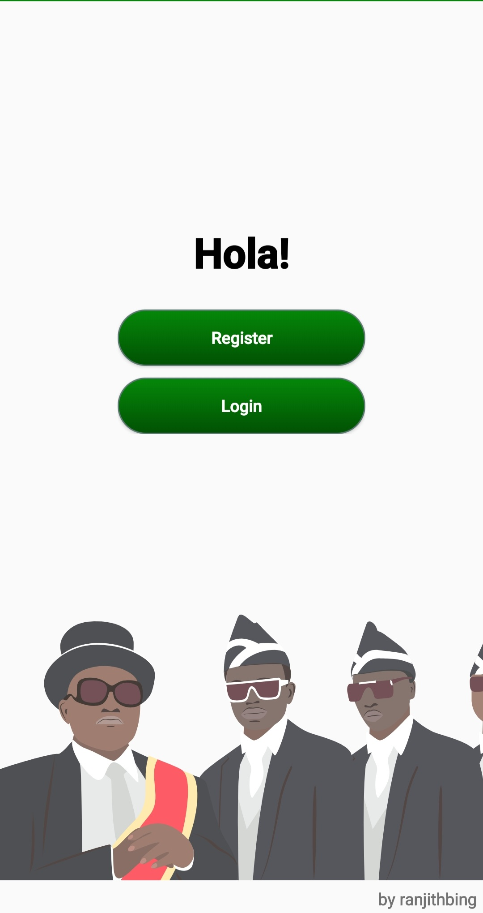
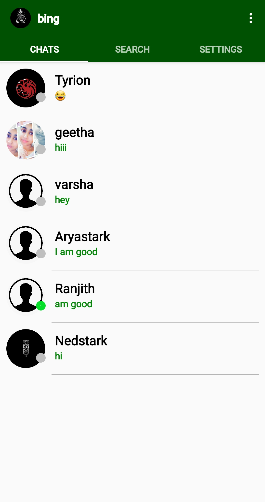
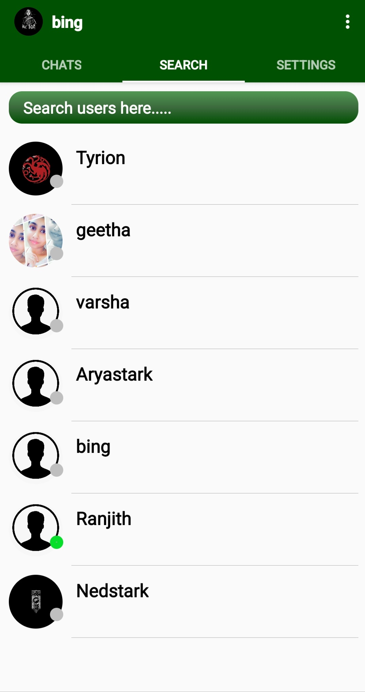
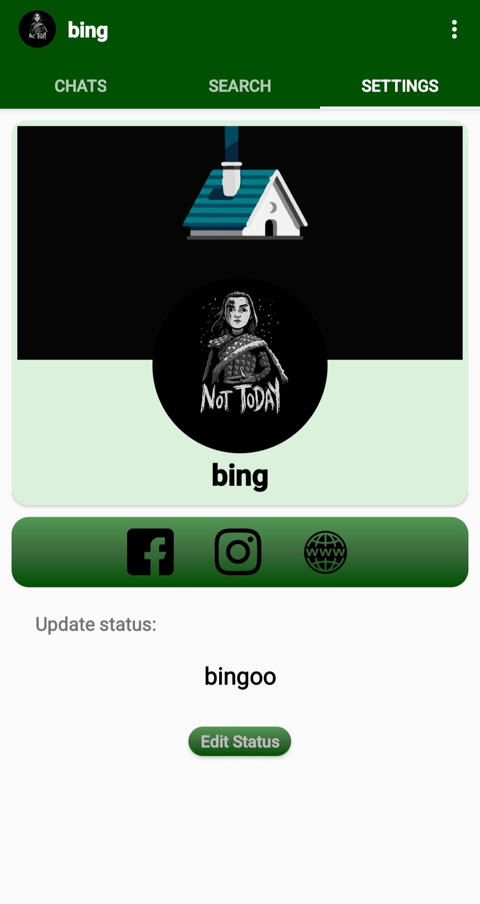
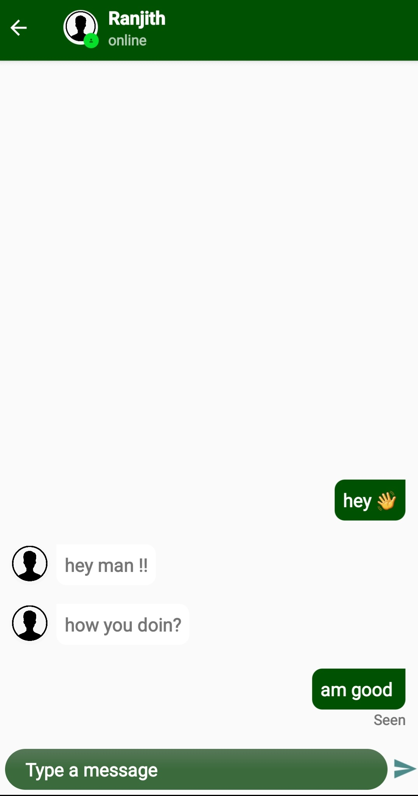
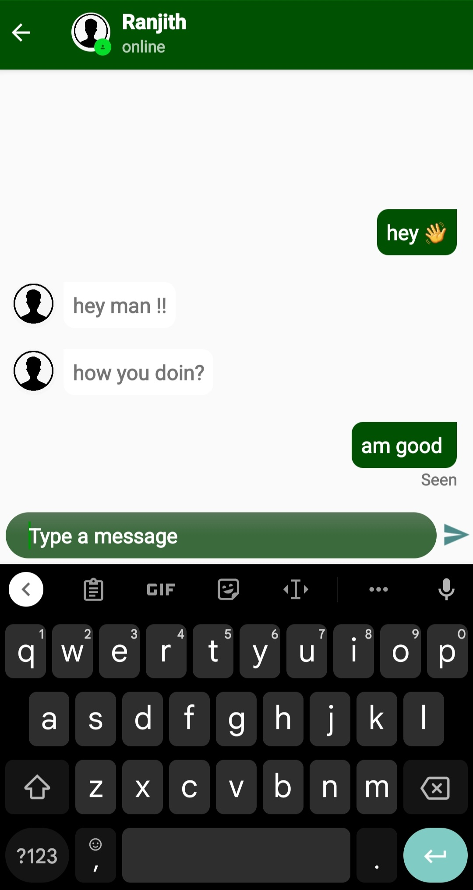

## Messenger 

After being inspired by WhatsApp, I developed an Android Messenger application that mimics most of its famous features. The app was developed natively on the android studio using Kotlin. To authenticate, transfer chat, store and fetch user details, as a backend, the app uses Google’s Firebase. The app allows users to create a profile using an email id for now. The Chats tab displays all the chats with other users along with the online/online indicator and the last received message. Users can look for other users by using the search tab. Users may edit their personal, status, and social information on the settings tab which gets displayed whenever a user’s profile picture is clicked. For the time being, The chats activity allows users to send text messages, which also lets users know whether the recipient has read their message or not. 
 

     

## :camera_flash: Screenshots 

|  
Login Layout|  
Chats Home Fragment |  
Search Fragment
| ---------------------------------------------- | -------------------------------------------- | ------------------------------------------- | 
 

|  
Settings Fragment |  
Chats Activity |  
| ---------------------------------------------- | -------------------------------------------- | ------------------------------------------- |
